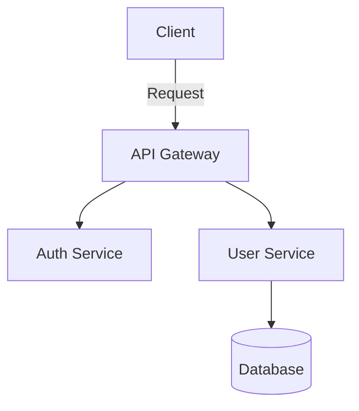

# Documentation

Documente le code suivant :

$ARGUMENTS

## Objectif

Créer une documentation **utile, maintenable et accessible** qui aide les développeurs à comprendre et utiliser le code.

---

## ⛔ LIMITES STRICTES DE CETTE SKILL

### ✅ CE QUE CETTE SKILL FAIT
- Écrire/mettre à jour la documentation (README, API docs, JSDoc)
- Ajouter des commentaires de code pertinents
- Créer des exemples d'utilisation
- Documenter la configuration

### ❌ CE QUE CETTE SKILL NE FAIT PAS
- **PAS de code** : Documenter, pas implémenter
- **PAS de refactoring** : Si le code est confus, suggérer `/refactor`
- **PAS de tests** : Documenter les tests existants, pas en écrire
- **PAS de bug fixes** : Si tu trouves un bug, note-le pour `/debug`

### 🛑 SI LE CODE EST TROP CONFUS À DOCUMENTER
STOP ! Propose `/refactor` d'abord, puis reviens documenter.

---

---

## 0. Consultation SERENA

### Contexte du projet

```
mcp__serena__list_memories - Standards de documentation existants
mcp__serena__search_for_pattern - Exemples de documentation dans le projet
mcp__serena__get_symbols_overview - Structure du code à documenter
```

### Questions préliminaires

1. Quel format de documentation est utilisé ? (JSDoc, docstrings, etc.)
2. Où se trouve la documentation existante ?
3. Quel niveau de détail est attendu ?

---

## 1. Principes de Documentation

### Ce qui doit être documenté

| Type | Quand documenter |
|------|------------------|
| **APIs publiques** | Toujours |
| **Logique complexe** | Quand le "pourquoi" n'est pas évident |
| **Workarounds** | Toujours, avec contexte |
| **Configuration** | Options et valeurs par défaut |
| **Architecture** | Décisions et patterns |

### Ce qui NE doit PAS être documenté

| Type | Pourquoi éviter |
|------|-----------------|
| Code évident | Bruit, maintenance inutile |
| "Quoi" fait le code | Le code le dit déjà |
| Historique Git | Utiliser le VCS |
| TODOs abandonnés | Nettoyer ou créer des issues |

---

## 2. Documentation Inline (`--inline`)

### Format JSDoc/TSDoc

```typescript
/**
 * Calcule le prix total d'une commande avec remises.
 *
 * @param items - Liste des articles avec leurs prix
 * @param discountCode - Code de réduction optionnel
 * @returns Le prix total après application des remises
 * @throws {InvalidDiscountError} Si le code de réduction est invalide
 *
 * @example
 * ```typescript
 * const total = calculateTotal(items, 'SUMMER20');
 * console.log(total); // 80.00
 * ```
 *
 * @see {@link applyDiscount} pour les règles de remise
 * @since 2.0.0
 */
function calculateTotal(
  items: OrderItem[],
  discountCode?: string
): number {
  // ...
}
```

### Format Python docstrings

```python
def calculate_total(items: list[OrderItem], discount_code: str = None) -> float:
    """
    Calcule le prix total d'une commande avec remises.

    Args:
        items: Liste des articles avec leurs prix
        discount_code: Code de réduction optionnel

    Returns:
        Le prix total après application des remises

    Raises:
        InvalidDiscountError: Si le code de réduction est invalide

    Example:
        >>> total = calculate_total(items, 'SUMMER20')
        >>> print(total)
        80.00
    """
    pass
```

### Commentaires de code

```typescript
// ✅ BON : Explique le "pourquoi"
// Utilise setTimeout car l'API rate-limite à 100 req/min
await delay(600);

// ❌ MAUVAIS : Répète le "quoi"
// Incrémente le compteur
counter++;
```

---

## 3. Documentation API (`--api`)

### Format OpenAPI/Swagger

```yaml
/api/users/{id}:
  get:
    summary: Récupère un utilisateur par ID
    description: |
      Retourne les informations complètes d'un utilisateur.
      Nécessite une authentification avec un token valide.
    parameters:
      - name: id
        in: path
        required: true
        description: ID unique de l'utilisateur
        schema:
          type: string
          format: uuid
    responses:
      200:
        description: Utilisateur trouvé
        content:
          application/json:
            schema:
              $ref: '#/components/schemas/User'
      404:
        description: Utilisateur non trouvé
```

### Documentation d'endpoint

```markdown
## GET /api/users/:id

Récupère les informations d'un utilisateur.

### Paramètres

| Nom | Type | Requis | Description |
|-----|------|--------|-------------|
| id | UUID | ✅ | ID de l'utilisateur |

### Headers

| Header | Valeur | Description |
|--------|--------|-------------|
| Authorization | Bearer {token} | Token d'authentification |

### Réponses

#### 200 OK
```json
{
  "id": "123e4567-e89b-12d3-a456-426614174000",
  "email": "user@example.com",
  "name": "John Doe",
  "createdAt": "2024-01-15T10:30:00Z"
}
```

#### 404 Not Found
```json
{
  "error": "USER_NOT_FOUND",
  "message": "User with id '...' not found"
}
```

### Exemple cURL

```bash
curl -X GET "https://api.example.com/api/users/123" \
  -H "Authorization: Bearer eyJhbGc..."
```
```

---

## 4. Documentation README (`--readme`)

### Structure standard

```markdown
# Nom du Projet

> Description courte en une ligne

## Table des Matières
- [Installation](#installation)
- [Utilisation](#utilisation)
- [Configuration](#configuration)
- [API](#api)
- [Contributing](#contributing)
- [License](#license)

## Installation

```bash
npm install mon-package
```

## Utilisation

### Exemple basique

```typescript
import { MonModule } from 'mon-package';

const instance = new MonModule({ option: 'valeur' });
const result = instance.doSomething();
```

### Cas d'usage avancé

[Exemple plus complexe avec contexte]

## Configuration

| Option | Type | Défaut | Description |
|--------|------|--------|-------------|
| `option1` | string | `"default"` | Description de l'option |
| `option2` | number | `10` | Description de l'option |

## API

[Lien vers documentation API complète ou résumé]

## Contributing

Voir [CONTRIBUTING.md](./CONTRIBUTING.md)

## License

MIT
```

---

## 5. Documentation d'Architecture

### Format ADR (si pas déjà documenté)

```markdown
# ADR-XXX : [Titre de la décision]

## Statut
Accepté

## Contexte
[Pourquoi cette décision était nécessaire]

## Décision
[Ce qui a été décidé]

## Conséquences
[Impact positif et négatif]
```

### Diagrammes

```
Utiliser des diagrammes ASCII ou Mermaid :


```

---

## 6. Documentation de Configuration

### Format recommandé

```markdown
## Configuration

### Variables d'environnement

| Variable | Requis | Défaut | Description |
|----------|--------|--------|-------------|
| `DATABASE_URL` | ✅ | - | URL de connexion PostgreSQL |
| `LOG_LEVEL` | ❌ | `info` | Niveau de log (debug, info, warn, error) |
| `CACHE_TTL` | ❌ | `3600` | Durée du cache en secondes |

### Fichier de configuration

```yaml
# config.yaml
database:
  host: localhost
  port: 5432
  name: myapp

logging:
  level: info
  format: json
```

### Priorité de configuration

1. Variables d'environnement (priorité haute)
2. Fichier de configuration
3. Valeurs par défaut (priorité basse)
```

---

## 7. Changelog

### Format Keep a Changelog

```markdown
# Changelog

All notable changes to this project will be documented in this file.

## [Unreleased]

### Added
- Nouvelle fonctionnalité X

### Changed
- Modification du comportement de Y

### Fixed
- Correction du bug Z (#123)

## [1.2.0] - 2024-01-15

### Added
- Support pour la fonctionnalité A
- Nouveau endpoint `/api/feature`

### Deprecated
- `oldMethod()` sera supprimé en v2.0

### Security
- Mise à jour de la dépendance vulnérable
```

---

## 8. Génération de Documentation

### Outils par langage

| Langage | Outil | Commande |
|---------|-------|----------|
| TypeScript | TypeDoc | `typedoc --out docs src/` |
| Python | Sphinx | `sphinx-build -b html docs/ build/` |
| Rust | Rustdoc | `cargo doc` |
| Go | GoDoc | `godoc -http=:6060` |

### Automatisation

```yaml
# .github/workflows/docs.yml
name: Generate Docs
on:
  push:
    branches: [main]
jobs:
  docs:
    runs-on: ubuntu-latest
    steps:
      - uses: actions/checkout@v3
      - run: npm run docs
      - uses: peaceiris/actions-gh-pages@v3
        with:
          publish_dir: ./docs
```

---

## 9. Validation de Documentation

### Checklist

- [ ] La documentation est à jour avec le code
- [ ] Les exemples fonctionnent (testés)
- [ ] Les liens sont valides
- [ ] La grammaire et l'orthographe sont correctes
- [ ] Le format est cohérent
- [ ] Les informations sensibles sont exclues

### Tests de documentation

```bash
# Vérifier les exemples de code
npm run test:docs

# Vérifier les liens
npx markdown-link-check README.md
```

---

## 10. Capitalisation SERENA

### Sauvegarder les templates

```
mcp__serena__write_memory
```

**À capitaliser :**
- Templates de documentation réutilisables
- Standards de documentation du projet
- Exemples de bonne documentation

### Format de mémoire

```markdown
# Documentation Standards

## Templates
[Templates réutilisables]

## Conventions
[Règles de documentation du projet]

## Exemples
[Liens vers de bons exemples dans le projet]
```

---

## 11. Maintenance de Documentation

### Bonnes pratiques

1. **Documenter au moment du code** - Pas "plus tard"
2. **Revue de documentation** - Inclure dans les PR
3. **Tests de documentation** - Vérifier que les exemples fonctionnent
4. **Documentation as code** - Versionnée avec le code
5. **Automatisation** - Génération, validation, publication

### Éviter la dette de documentation

- [ ] Retirer la documentation obsolète
- [ ] Mettre à jour lors des changements de code
- [ ] Marquer clairement les versions

---

## Transition vers la prochaine phase

| Situation | Prochaine skill |
|-----------|-----------------|
| Documentation complète | `/capitalize` (puis roadmap → merge) |
| Code à améliorer | `/refactor` |
| Tests manquants | `/test-write` |

---

## 🔄 IMPORTANT : Continuité du Workflow

### À la fin de cette skill, TOUJOURS :

1. **Mettre à jour le workflow** :
```
mcp__serena__edit_memory
  memory_file_name: "workflow-current.md"
  → Ajouter dans Historique : /document ✅
  → Lister les fichiers de documentation créés/modifiés
```

2. **Afficher le résumé de transition** :
```markdown
---
## ✅ Documentation Terminée

**Fichiers documentés** :
- [fichier1] - [type de doc]
- [fichier2] - [type de doc]

→ **Prochaine étape** : `/capitalize` pour sauvegarder les apprentissages

⚠️ **Rappel du flux** : document → capitalize → roadmap-update --done → pre-merge

💡 `/next` pour voir le workflow complet
---
```
